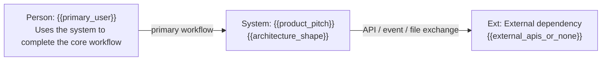
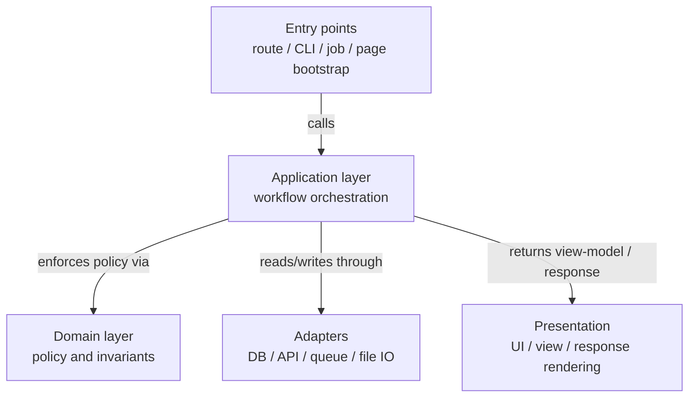
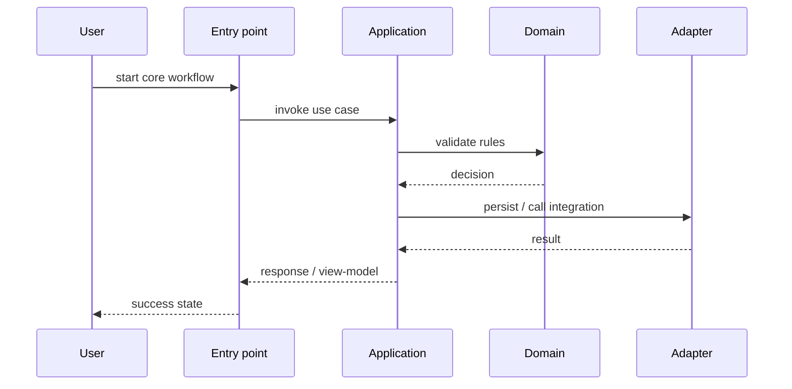
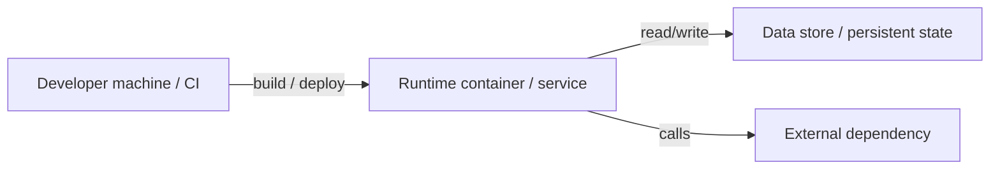

# 기술 설계 플레이북

> Kitchen 리소스입니다. 제품 답변, 저장소 감지 결과, command 감지 결과로 생성합니다.
> 이 문서는 `.agent/spec/design.md`의 source of truth이며, arc42의 섹션 구조와 C4의 계층/다이어그램 사고방식을 섞어 “지금 구현해야 할 시스템”을 설명합니다.
> 구현 전에 가장 먼저 읽어야 하는 architecture 기준 문서이며, 기본 코딩 stance는 Hexagonal architecture와 TDD를 중시합니다.
> 따라서 이 문서는 단순한 기술 개요가 아니라, 어떤 경계를 둘지, 어떤 책임을 core에 둘지, 어떤 adapter를 둘지, 어떤 순서로 검증할지를 함께 설명해야 합니다.
> Mermaid block은 초기 다이어그램 뼈대입니다. renderer가 Mermaid를 몰라도 텍스트로 읽을 수 있게 제목, 범위, 범례, 관계 label을 함께 남깁니다.
> 사용자가 architecture 방향을 지정하지 않으면 선택된 `{{preset_type}}` preset의 기본 stance를 먼저 적용합니다. architecture 기본값은 Hexagonal architecture와 TDD이며, 사용자 입력과 repo facts가 있으면 그것이 우선합니다.

## Preset defaults applied

- Selected preset: {{preset_type}}
- Selection reason: {{preset_reason}}
- Precedence: user explicit input -> repo facts -> preset defaults -> generic fallback
- Building block naming tone: {{building_block_tone}}
- Runtime scenario style: {{runtime_style}}
- Deployment / operational emphasis: {{operational_emphasis}}

이 문서는 preset을 참고하는 메모가 아니라, 선택된 preset을 바탕으로 kitchen이 생성한 architecture 결과물입니다.

## 1. Introduction And Goals

### Product context

- 제품 설명: {{product_pitch}}
- 핵심 사용자: {{primary_user}}
- MVP 기능:
  - {{mvp_capability_1}}
  - {{mvp_capability_2}}
  - {{mvp_capability_3}}
- 제외 범위:
  - {{anti_scope_1}}
  - {{anti_scope_2}}

### Top quality goals

중요도 순서로 최대 다섯 개만 둡니다.

1. End-to-end MVP workflow가 안정적으로 동작합니다.
2. 변경은 spec에 연결되고 review 가능하게 유지됩니다.
3. verification이 설정되고 green이기 전에는 release가 blocked입니다.
4. 제품 핵심 state는 보이고 test 가능해야 합니다.
5. UI가 있다면 접근 가능하고 일관되어야 합니다.

## 2. Constraints

- stack, database, auth, queue, external API 선택을 임의로 만들지 않습니다.
- 새 architecture보다 기존 저장소 구조를 우선합니다.
- native command는 `.agent/commands.json`을 사용합니다.
- release/deploy/push에는 사람 승인이 필요합니다.
- 미확정 integration은 “unknown”으로 남기고 확정된 사실처럼 쓰지 않습니다.

## 3. Context And Scope

### Detected facts

- Stack: {{detected_stack}}
- Package manager: {{detected_package_manager}}
- Runtime: {{detected_runtime}}
- Frontend hint: {{frontend_hints}}
- Backend/API hint: {{backend_hints}}
- 주요 entry point: {{entry_points}}
- Source directory: {{source_directories}}
- Test directory: {{test_directories}}
- Configuration file: {{config_files}}
- User/actor: {{actors}}
- External APIs: {{external_apis_or_none}}
- Data store: {{data_stores_or_none}}
- Background job/queue: {{jobs_or_none}}
- Auth/payment: {{auth_payment_or_none}}

### Open questions

- deploy surface:
- internal admin interface:
- analytics / observability surface:

### Context diagram guidance

- 다이어그램 제목은 범위와 타입을 함께 씁니다.
- 모든 element에는 type, 짧은 책임 설명, 관계 label을 둡니다.
- acronym과 protocol은 legend 또는 label로 설명합니다.



## 4. Solution Strategy

### Architecture

- 형태: {{architecture_shape}}
- building block naming tone: {{building_block_tone}}
- runtime scenario style: {{runtime_style}}
- deployment emphasis: {{operational_emphasis}}
- repo가 이미 말해주는 구조를 우선 사용합니다.
- 큰 구조를 바꾸기 전에 spec, command profile, existing entry point를 먼저 존중합니다.
- system context와 container 수준 설명만으로 충분하면 component 수준까지 내려가지 않습니다.
- 아키텍처 설명은 최소한 entry point, application, domain, adapter, presentation 중 무엇이 실제로 필요한지와 각 경계의 책임을 분명히 적습니다.
- “어디에 코드를 둘까”보다 “어떤 변화가 core를 흔들면 안 되는가”를 먼저 설명합니다.

### Core implementation principles

- `.agent/spec/design.md`는 구현 전 반드시 읽는 architecture 기준 문서입니다.
- 기본 코딩 stance는 TDD입니다. 가능한 한 실패하는 test 또는 focused executable check를 먼저 만들고 red -> green -> refactor 순서로 진행합니다.
- Clean Architecture, Hexagonal Architecture, TDD의 공통 목표는 자주 바뀌는 I/O, framework, UI, database, external API로부터 domain/application core를 보호하는 것입니다.
- 도메인 규칙이 있는 제품은 UI, framework, database, external API로부터 domain/application logic을 분리합니다.
- Hexagonal architecture 또는 ports-and-adapters 구조는 기본 선호 아키텍처입니다. domain-heavy, integration-heavy, long-lived service에서는 우선 적용하고, 작은 프로젝트에서도 boundary를 설명하는 기본 사고방식으로 사용합니다.
- 작은 script, 정적 site, 단순 prototype에는 과한 layer를 만들지 않고 기존 repo 구조 안에서 boundary만 명확히 둡니다.
- business rule은 framework callback이나 UI component 안에 숨기지 않고 test 가능한 module로 분리합니다.
- 외부 I/O는 adapter 뒤에 두고, core logic은 fake 또는 stub으로 검증 가능해야 합니다.
- dependency direction은 entry point -> application -> domain으로 흐르게 하고, domain이 infrastructure를 직접 import하지 않게 합니다.
- domain은 framework, ORM, SDK, transport DTO를 직접 알지 않아야 합니다. 필요한 바깥 기능은 application 쪽 port로 정의하고 adapter가 구현합니다.
- deep module을 선호합니다. deep module은 작은 public interface 뒤에 중요한 내부 복잡도, policy, invariant를 숨깁니다.
- shallow module을 지양합니다. shallow module은 단순 wrapper, 책임 없는 pass-through layer, 호출부보다 내부 복잡도를 줄이지 못하는 module입니다.
- architecture 개선은 얕은 계층을 늘리는 방식이 아니라, 응집도 높은 deep module과 명확한 boundary를 만드는 방향으로 수행합니다.

### Why Hexagonal architecture here

- 이 시스템의 핵심 규칙과 workflow는 UI, transport, database, external API보다 오래 살아남는다는 가정으로 설계합니다.
- 따라서 HTTP route, CLI command, worker, cron, webhook 같은 entry point는 core를 호출하는 driving adapter로 취급합니다.
- persistence, payment, queue, email, clock, UUID, external API는 driven adapter로 취급하고, application core가 좁은 port를 정의합니다.
- 새로운 integration이나 화면이 추가되더라도 domain/application core가 다시 쓰일 수 있어야 하며, adapter 교체가 core 규칙 변경으로 번지지 않아야 합니다.
- 저장소가 아주 작더라도 이 문서는 “core policy와 바깥 I/O를 분리한다”는 기준을 유지하고, 과한 layer 수 대신 명확한 dependency direction을 우선합니다.

### How TDD fits this architecture

- TDD는 테스트를 먼저 쓰는 습관이 아니라, architecture boundary를 실제로 고정하는 방법입니다.
- use case는 outside-in으로 시작해 entry point가 application use case를 어떻게 호출하는지 먼저 고정합니다.
- domain rule은 inside-out으로 세분화해 invariant, state transition, validation rule을 빠른 test로 잠급니다.
- driven port가 생기면 mock 남발보다 fake, stub, contract-style integration check를 우선해 adapter seam이 실제로 분리돼 있는지 검증합니다.
- green 이후 refactor 단계에서는 이름 정리뿐 아니라 port 크기 축소, adapter 책임 분리, shallow module 제거까지 포함합니다.

### Port and adapter rules

| Boundary | Who calls it | Who defines it | Implementation rule |
| --- | --- | --- | --- |
| Driving port / inbound use case | entry point, UI, CLI, scheduler, test | application core | 사용자 의도를 표현하고 transport 타입을 core로 새기지 않습니다. |
| Driven port / outbound SPI | application core | application core | DB, payment, clock, UUID, external API 같은 바깥 기능을 최소 계약으로 둡니다. |
| Driving adapter | user, HTTP, CLI, worker | outer layer | request를 command/view-model로 변환하고 use case를 호출합니다. |
| Driven adapter | application core through port | outer layer | SDK/SQL/API detail과 DTO mapping을 감추고 domain model을 오염시키지 않습니다. |

### Boundary ownership rules

| Layer | Owns | Must not own |
| --- | --- | --- |
| Entry point / driving adapter | request parsing, auth context handoff, protocol/status mapping | business rule, persistence detail, external SDK orchestration |
| Application | use case orchestration, transaction boundary, port definition, workflow policy | framework callback, raw SQL/SDK detail, rendering concern |
| Domain | invariant, state transition, business terminology, validation rule | HTTP shape, ORM annotation, queue protocol, UI concern |
| Driven adapter | SQL/ORM, SDK/API client, file/queue/clock integration | domain rule, cross-use-case workflow policy |
| Presentation | view-model, component composition, loading/error/empty state | domain invariant, persistence concern |

## Architecture Review Checklist

새 기능이나 refactor를 review할 때 다음 항목을 확인합니다.

1. domain/application core가 framework, ORM, SDK, HTTP, UI, filesystem 같은 I/O detail을 직접 import하지 않습니다.
2. business rule은 domain object나 application use case에 있고, adapter나 controller는 mapping과 protocol 처리에 집중합니다.
3. outbound dependency가 필요하면 application이 좁은 driven port를 정의하고 adapter가 구현합니다.
4. port는 유스케이스가 실제로 필요한 만큼만 작게 유지하고, SQL/filter/pagination detail을 core에 밀어 넣지 않습니다.
5. 시간, random, UUID, external API, persistence는 test double로 대체 가능해야 합니다.
6. domain 상태 변경은 public field mutation이 아니라 의도를 드러내는 method/function을 통해 일어납니다.
7. ORM entity, DB row, transport DTO와 domain model은 같은 타입으로 합치지 않습니다.
8. mock은 협력 호출 자체가 요구사항일 때만 쓰고, 가능한 경우 fake나 stub으로 behavior를 검증합니다.
9. domain/application test가 느려지면 숨은 I/O, global singleton, static time/random을 의심합니다.
10. 같은 use case가 HTTP 외의 CLI, worker, test entry point로도 호출될 수 있는 boundary인지 확인합니다.

## 5. Building Blocks

### Level 1 building blocks

| Name | Responsibility | Interfaces | Code location | Open issues |
| --- | --- | --- | --- | --- |
| Entry points | request, CLI, job, UI bootstrap를 받는 지점 | HTTP route, command, event, page load | {{entry_points}} | |
| Core application | user-visible workflow와 orchestration | service calls, use-case API | {{source_directories}} | |
| Domain / policy | business rule, invariant, validation | function/module boundary | {{source_directories}} | |
| Integration / adapter | DB, external API, queue, filesystem | protocol, SDK, client | {{source_directories}} | |
| UI / presentation | browser or view rendering | page, component, template | {{frontend_hints}} | |

### Level 1 container / module sketch



### Important interfaces

- user-facing request/response boundary:
- internal module boundary:
- integration protocol boundary:
- primary driving ports / use cases:
- primary driven ports / outbound contracts:

## 6. Runtime Scenarios

### Runtime diagram guidance

- happy path 1개, 실패 path 1개, background/integration path 1개를 기본으로 둡니다.
- runtime은 “무엇이 어떤 순서로 상호작용하는지”를 보여주고, 구현 세부사항 나열로 흐르지 않습니다.
- use case 중심 scenario는 outside-in으로 시작하고, domain invariant는 inside-out 단위 test로 별도 고정합니다.
- 각 scenario는 어떤 driving port가 시작점인지, 어떤 driven adapter가 관여하는지, 어디서 domain rule이 검증되는지를 드러냅니다.

### Happy path

| Scenario | Trigger | Expected outcome | Verification |
| --- | --- | --- | --- |
| 핵심 happy path | 사용자가 {{mvp_capability_1}}를 시작함 | workflow가 끝까지 완료되고 state가 일관되게 남음 | `test` 또는 `e2e` |



### Failure path

| Scenario | Trigger | Expected outcome | Verification |
| --- | --- | --- | --- |
| 핵심 failure path | validation 또는 integration 실패 | error state가 보이고 recovery path가 명확함 | `test` 또는 manual check |

### Background or integration path

| Scenario | Trigger | Expected outcome | Verification |
| --- | --- | --- | --- |
| background / integration path | queue, cron, webhook, async sync 발생 | side effect가 관찰 가능하고 retry/alerting 기준이 명확함 | integration test / manual |

## 7. Deployment And Operational Notes

- Runtime surface: {{detected_runtime}}
- Deploy surface:
- Environment split:
- Secret/config boundary:
- Observability entry point:



## 8. Cross-cutting Concepts

- logging, configuration, error handling, auth boundary를 명시하고 흩어지게 두지 않습니다.
- schema, storage, external contract 변경은 migration, backward compatibility, rollback path를 함께 기록합니다.
- user-facing failure는 관찰 가능해야 하며 retry와 alerting 필요 여부를 판단합니다.
- performance budget이 필요한 workflow는 latency, payload, query count 같은 측정 가능한 기준을 둡니다.
- UI는 keyboard navigation, focus state, readable contrast, loading/error/empty state를 acceptance에 포함합니다.
- dependency 추가는 license, maintenance status, bundle/runtime cost, lockfile 변화를 확인합니다.
- `.agent/commands.json`의 `test`, `e2e`, `lint`, `build`, `verify` command가 공식 실행 경로입니다.

## 9. Architectural Decisions

수락된 기술 결정은 `.agent/wiki/decisions/`에 둡니다.

| Decision | Status | Why it exists | Follow-up |
| --- | --- | --- | --- |
| architecture shape | proposed / accepted | top-level decomposition 이유 | |
| storage / integration choice | proposed / accepted | external boundary 이유 | |
| UI pattern or token policy | proposed / accepted | cross-screen consistency 이유 | |

- Proposed decision은 `forage` 또는 `recipe`가 작성합니다.
- 승인된 ADR은 supersession note를 제외하고 append-only입니다.

## 10. Quality Requirements

- Functional correctness: 핵심 workflow가 acceptance criteria를 만족합니다.
- Testability: domain/application logic은 빠른 test로 검증 가능해야 하며, 가능한 경우 TDD로 먼저 고정합니다.
- Test pyramid: domain unit test와 application/use-case test를 가장 빠른 feedback 층으로 두고, adapter integration test와 E2E는 핵심 workflow와 위험한 failure path에 집중합니다.
- TDD loop: use case는 outside-in으로 진입점을 고정하고, domain rule은 inside-out으로 불변식을 세분화한 뒤, green 직후 refactor로 이름, boundary, 중복을 정리합니다.
- Seam verification: port가 있다고 주장하는 모든 경계는 test double 또는 contract check로 실제 분리 가능함을 보여야 합니다.
- Adapter coverage: persistence/external API adapter는 “core가 기대하는 계약”과 “실제 기술 세부사항” 사이의 mapping 오류를 잡는 검증이 있어야 합니다.
- Operability: 실패와 retry path가 관찰 가능합니다.
- Accessibility: UI가 있다면 focus, contrast, color-only 금지, reduced motion을 준수합니다.
- Release safety: `verify` green 전에는 release가 blocked입니다.

## 11. Risks And Technical Debt

- 알 수 없는 verification command는 release를 막습니다.
- 확인되지 않은 integration을 assumption으로 구현하지 않습니다.
- 반복되는 project trap은 `.agent/memory/gotchas.md`에 둡니다.
- 아직 비어 있는 boundary나 diagram은 “미정”으로 남기고 조용히 가정하지 않습니다.

## 12. Glossary And Domain Alignment

- 핵심 entity: {{core_entities}}
- 중요한 state: {{important_states}}
- 위험한 assumption: {{dangerous_assumptions}}
- Ubiquitous language source of truth: `.agent/wiki/domain.md`
- spec, handoff, review, 사용자 커뮤니케이션은 `.agent/wiki/domain.md`의 용어를 우선 사용합니다.

## Command Profile

Command는 `.agent/commands.json`에 둡니다.

```json
{
  "setup": {{setup_command_or_null}},
  "build": {{build_command_or_null}},
  "test": {{test_command_or_null}},
  "e2e": {{e2e_command_or_null}},
  "lint": {{lint_command_or_null}},
  "verify": {{verify_command_or_null}},
  "dev": {{dev_command_or_null}}
}
```

## Verification 전략

- 구현 중에는 focused command를 사용합니다.
- merge/release 전에는 `verify`를 사용합니다.
- UI/browser 변경은 `e2e` command가 있으면 우선 실행하고, 없으면 Playwright MCP로 핵심 scenario를 수동 검증한 뒤 handoff에 남깁니다.
- `verify`가 `null`이면 설정될 때까지 release는 blocked입니다.
- automation이 없으면 manual check를 handoff에 기록합니다.

## Best-practice 근거

- goal, constraint, context, strategy, building block, runtime, deployment, decision, quality, risk, glossary를 포함합니다.
- architecture 문서는 그 자체로 방대하기보다 변경 작업과 review에 유용해야 합니다.
- C4처럼 context와 container 수준을 우선 설명하고, arc42처럼 품질 목표, 제약, 결정, 리스크를 함께 기록합니다.
