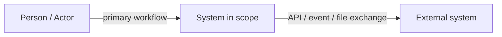
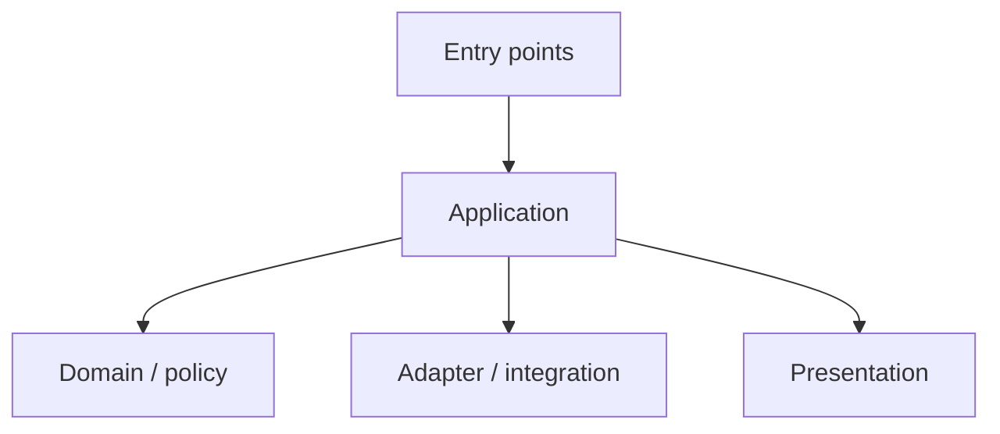
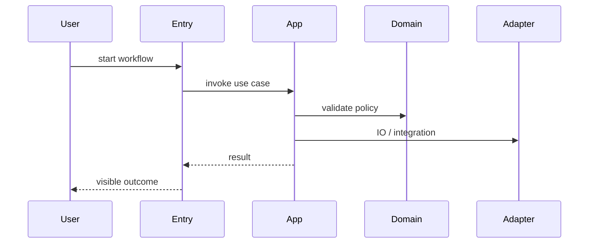
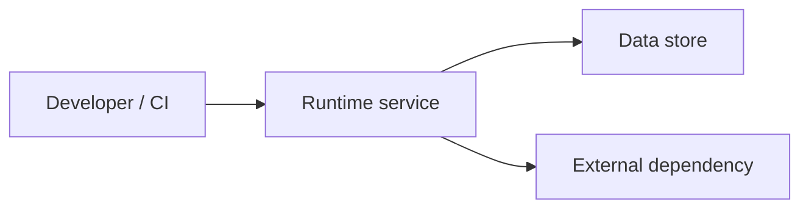

# Technical Design

Status: Fallback Playbook Skeleton

> `kitchen/init` does not copy this file directly. It generates `.agent/spec/design.md` from product answers and repo detection.
> This skeleton follows an arc42-style section flow with C4-style context and building-block thinking.
> When the user does not specify an architecture direction, kitchen should start from the selected preset stance. The default architecture stance is hexagonal architecture plus TDD.
> Treat `.agent/spec/design.md` as the primary architecture source of truth. Default implementation stance should favor hexagonal architecture and TDD.

## Preset Defaults Applied

- Selected preset:
- Selection reason:
- Precedence: user input -> repo facts -> preset defaults -> generic fallback
- Building block naming tone:
- Runtime scenario style:
- Deployment / operational emphasis:

This document should keep the selected preset metadata and the generated architecture result, not plugin-internal source paths.

## 1. Introduction And Goals

- Product pitch: generated from kitchen product brief.
- Primary user: generated from kitchen product brief.
- MVP capabilities: generated from kitchen MVP answers.
- Anti-scope: generated from kitchen MVP answers.
- Top quality goals: correctness, release safety, observability, accessibility where applicable.

## 2. Constraints

- Prefer detected repo structure over invented architecture.
- Use `.agent/commands.json` as the command source of truth.
- Human approval is required for release, deploy, push, auth/payment/data-loss changes.

## 3. Context And Scope

- Stack: inferred from repository files.
- Package manager: inferred from lockfiles.
- Runtime: inferred from project files.
- Frontend/backend hints: inferred from folder structure and dependencies.
- External interfaces: detected or unknown.
- Data stores: detected or unknown.



## 4. Solution Strategy

- Choose the simplest architecture matching the repository structure.
- Treat `.agent/spec/design.md` as the required pre-implementation read.
- Favor TDD: start from a failing test or focused executable check, then go red -> green -> refactor.
- Use Clean Architecture, Hexagonal Architecture, and TDD as one practical stance: protect the domain/application core from volatile IO, frameworks, UI, databases, and external APIs.
- Separate policy-heavy logic from framework and IO when the product actually has policy worth protecting.
- Favor hexagonal architecture / ports-and-adapters as the default boundary model, while keeping the number of layers pragmatic.
- Keep dependency direction as entry/adapter -> application -> domain. Domain must not import infrastructure, ORM, SDK, HTTP, UI, filesystem, or transport DTO details.
- Do not invent services, databases, queues, or external APIs unless detected or confirmed.

## Architecture Boundary Checklist

- Driving ports expose user intent as use-case APIs and stay free of transport types.
- Driven ports describe the minimal outbound contract needed by the application core.
- Driving adapters translate HTTP, CLI, worker, UI, or test entry points into use-case commands.
- Driven adapters hide SQL, SDK, API, filesystem, clock, UUID, and DTO mapping details.
- Domain state changes happen through intention-revealing methods/functions, not public field mutation.
- ORM entities, database rows, transport DTOs, and domain models remain separate unless the project is intentionally trivial.
- Prefer fakes or stubs for behavior tests; use mocks only when the required behavior is the collaboration call itself.
- If unit/use-case tests become slow, look for leaked IO, global singletons, static time, or static randomness.

## 5. Building Blocks

| Name | Responsibility | Interfaces | Code location | Open issues |
| --- | --- | --- | --- | --- |
| Entry points | | | | |
| Application | | | | |
| Domain / policy | | | | |
| Integration / adapter | | | | |
| Presentation | | | | |



## 6. Runtime Scenarios

| Scenario | Trigger | Expected outcome | Verification |
| --- | --- | --- | --- |
| Happy path | | | |
| Failure path | | | |
| Background / integration path | | | |

Runtime scenarios should start from the use-case boundary outside-in. Domain invariants should be locked separately with inside-out unit tests.



## 7. Deployment And Operational Notes

- Deploy surface:
- Secret/config boundary:
- Observability surface:



## 8. Cross-cutting Concepts

- Logging and error handling
- Configuration and secret boundaries
- Auth / permission boundaries
- Migration / rollback expectations
- Accessibility and UI state rules

## 9. Architectural Decisions

- Record accepted decisions in `.agent/wiki/decisions/`.
- Keep rationale and consequences explicit.

## 10. Quality Requirements

- Release gate uses `.agent/commands.json` `verify`.
- Tests should favor fast feedback in unit/domain layers and default to TDD when feasible.
- Use-case tests should validate orchestration with fakes/stubs and no real IO.
- Adapter integration tests should verify mapping and protocol behavior at the boundary.
- E2E is reserved for workflow-critical paths.
- Refactor after green to improve names, boundaries, duplication, and misplaced policy without changing behavior.

## 11. Risks And Technical Debt

- Unknown verify command blocks release.
- Unconfirmed integrations remain explicit assumptions.
- Repeated traps belong in `.agent/memory/gotchas.md`.

## 12. Glossary And Domain Alignment

- Use `.agent/wiki/domain.md` as the ubiquitous language source of truth.

## Command Profile

Commands live in `.agent/commands.json`.

```json
{
  "setup": null,
  "build": null,
  "test": null,
  "e2e": null,
  "lint": null,
  "verify": null,
  "dev": null
}
```

## Verification Strategy

- Focused commands may be used during implementation.
- Release requires the project verify command.
- If `verify` is `null`, release stays blocked until configured.

## Recommended Defaults Applied

- Record any kitchen defaults chosen because the user did not specify them.
